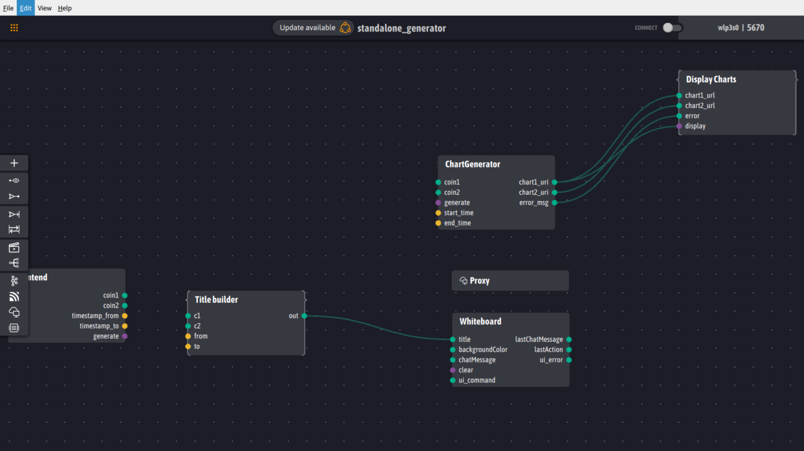

# Project IHM : Cryptocurrency Comparison

#### Author

- Gabriel Gervais
- Guohao Dai
- Hamid Oukhnini
- Hamza Hathoute

#### Overview

We are trying to build a web application IHM system on Cryptocurrency Comparison using `Ingenuity i/o`. The project is built using the python language and uses web pages for user input and display of results.

The following are some screenshots of a simple test of the project :

- `standalone_generator`

- `frontend_generator`

- Web page

- Result (test with "BTC" and "ETH")

