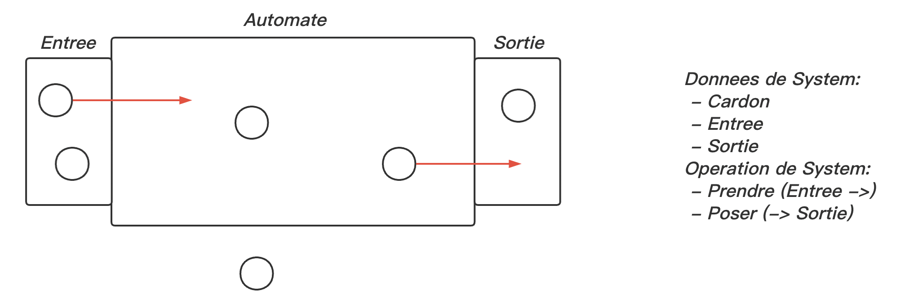

# TP1 – Des Cartons et des Hommes

Properties：

- Automate ne pend pas de cardons $\qquad \to \qquad $ Surete (Correction)

  $\forall c, c \in Cardons \quad \Rightarrow \quad c \in Entree \or c \in Sortie$

- Automate finit par traiter tous les cardons$\qquad \to \qquad $Terminaison / Convergence 

  