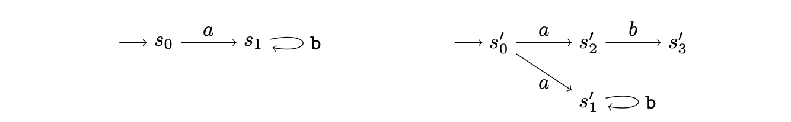
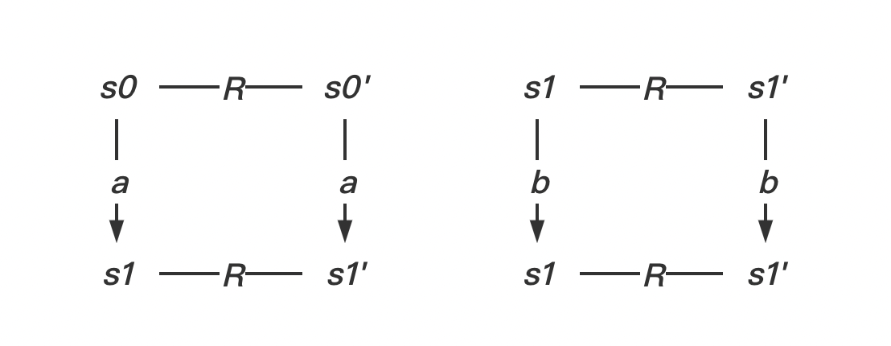
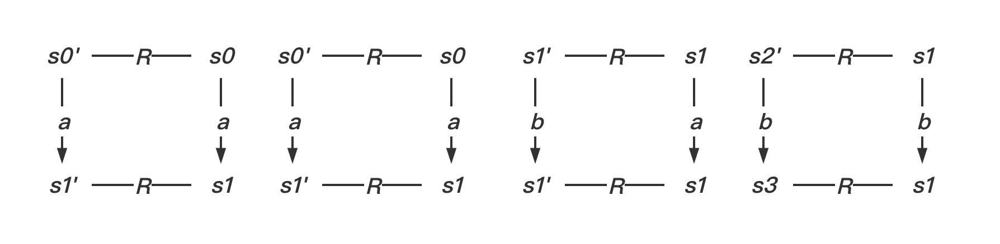

# TD 1. Systèmes de transitions

## (Bi)simulation forte.

#### 1 Bisimulation

Exercice 1 (Bisimulation forte) Pour chacun des points suivantes, répondre à la question puis prouver cette réponse.

1. S est il simulé par S′ ?

   $R = \{ <s_0,s_0'>, <s_1, s_1'>\}$ est une relation de simulation:

   

2. S simule t-il S′ ?

   $R = \{ <s_0',s_0>, <s_1', s_1>, <s_2', s_1>, <s_3', s_1>\}$ est une relation de simulation:

   

3. S et S ′ sont ils bisimilaires ?

   Calculons la plus grande relation de bisimulation entre S et S'. $R = \{ <s_1,s_1'>\}$ est la plus grande. Comme $s_0'$ n'set simule par rien dans $R$, S et S' ne sont pas bisimilaire. 

#### Exercice 6

- $R = \{ <\emptyset, C_2^0>, <C_2^0, \emptyset>, <\{a\}, C_2^1>, <C_2^1, \{a\}>, <\{b\}, C_2^1>, <C_2^1, \{b\}>, <\{a,b\}, C_2^2>, <C_2^2, \{a,b\}>\}$