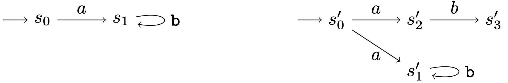
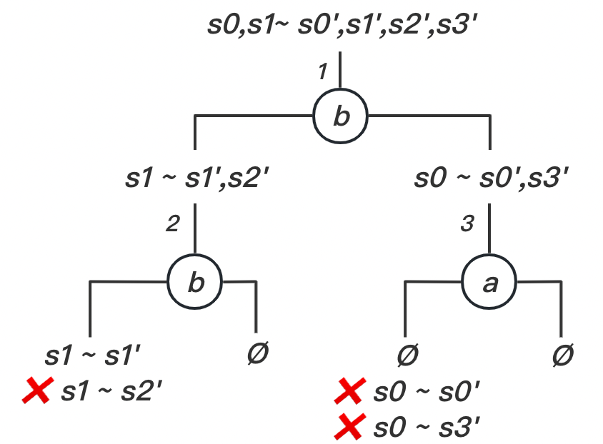
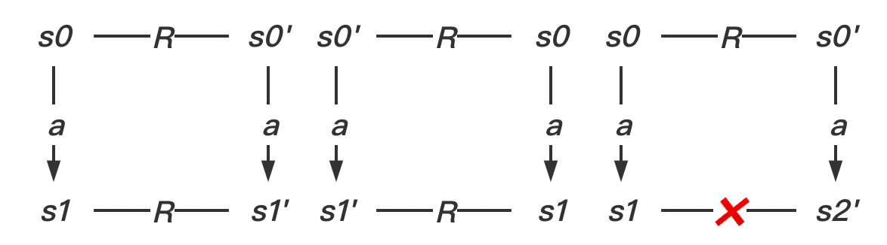
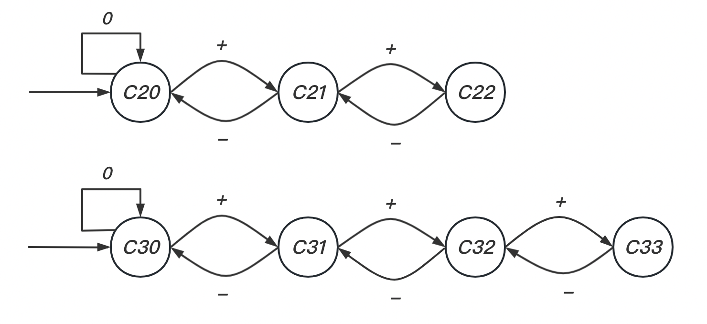
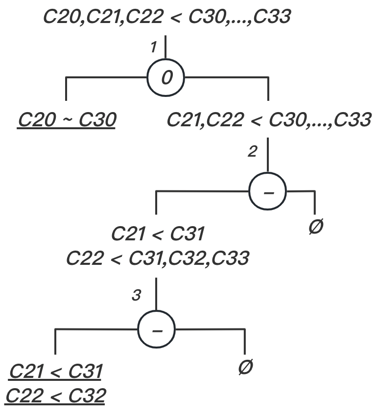
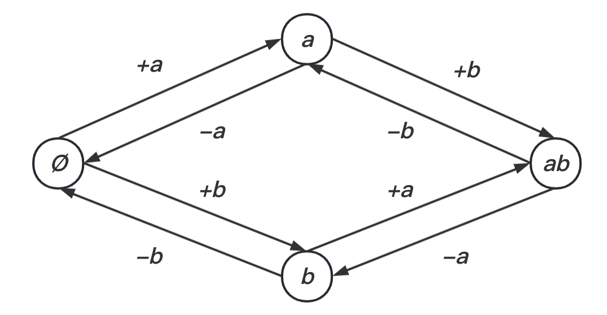
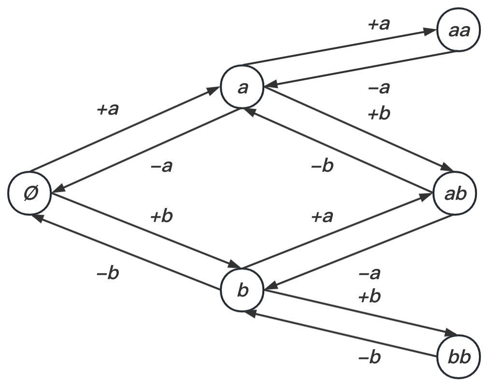
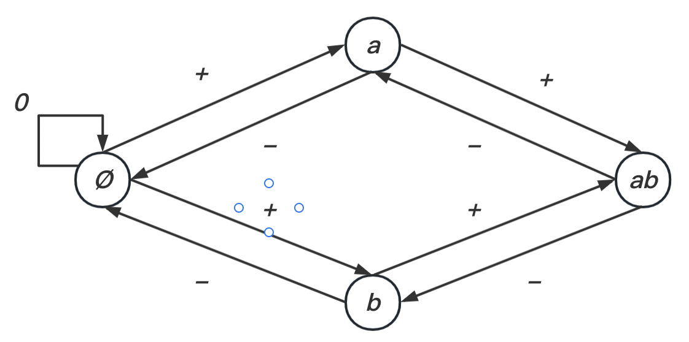

# TD 1. Systèmes de transitions

## (Bi)simulation forte.

#### EX1. Bisimulation

Exercice 1 (Bisimulation forte) Pour chacun des points suivantes, répondre à la question puis prouver cette réponse.

1. S est il simulé par S′ ?

   $R = \{ \langle s_0,s_0'\rangle, \langle s_1, s_1' \rangle\}$ est une relation de simulation:

   

2. S simule t-il S′ ?

   $R = \{ \langle s_0',s_0 \rangle, \langle s_1', s_1 \rangle, \langle s_2', s_1 \rangle, \langle s_3', s_1 \rangle\}$ est une relation de simulation:

   

3. S et S ′ sont ils bisimilaires ?

   Calculons la plus grande relation de bisimulation entre S et S'. $R = \{ \langle s_1,s_1' \rangle \}$ est la plus grande. Comme $s_0'$ n'set simule par rien dans $R$, <u>***S et S' ne sont pas bisimilaire***</u>. (初始状态不包含在最大模拟关系中)
   
   
   
   - For $\langle s_0,s_0'\rangle$ :

#### EX2. Compteur - Modélisation

Modéliser les compteurs $C_2$ et $C_3$.

#### EX3. Compteur - Simulation

1. Trouver une <u>***relation***</u> de simulation entre $C_2$ et $C_3$.

   The relation $R$ is shown as below
   $$
   R \triangleq \{ \langle C_2^0,C_3^0\rangle , \langle C_2^1,C_3^1\rangle , \langle C_2^2,C_3^2\rangle\}
   $$
   图略。

2. Calculer la plus grande simulation.

   

#### EX4. Ensembles - Modélisation

1. Modéliser un tel ensemble.

   

2. Modéliser un tel multi-ensemble.

   

#### EX 6. Ensembles - BiSimulation

Dans la modélisation de l'ensemble, on ignore l'élément dans les événements $+$ et $-$. Existe-t'il maintenant une relation de bisimulation entre le compteur $C_2$ et l'*ensemble* ?

$$
R = \{ \langle \varnothing, C_2^0 \rangle, \langle \{a\}, C_2^1 \rangle, \langle \{b\}, C_2^1 \rangle , \langle \{a,b\}, C_2^2 \rangle \}
$$
