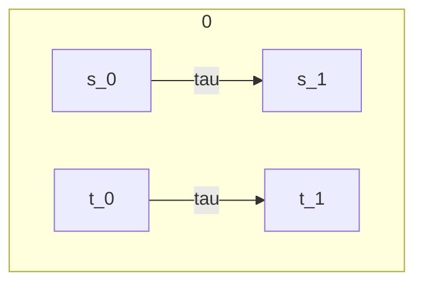
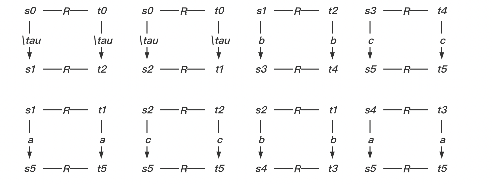

### TD 2. Systèmes de transitions. (Bi)simulation faible.

#### Exercice 1

- $R = \{<s_0, t_0>, <s_1, t_2>, <s_2, t_1>, <s_3, t_4>, <s_5, t_5>, <s_4, t_3>\}$

根据以上关系 $R$，画出每一个状态的如上述所示的转换图。

le plus grande relation de bisimulation entre $\mathcal{S}$ et  $\mathcal{T}$ est $R = \{<s_3, t_4>, <t_4,s_3>, <s_5, t_5>,  <t_5, s_5>, <s_4, t_3>, <t_3,s_4>\}$ or$<s0,t0> \notin R$ , they are not bisimulation

Exercice 2

- $R = \{<p_0, q_0>, <p_0, q_4>, <p_1, q_1>, <p_1, q_2>, <p_2, q_3>\}$

$\mathcal{P}$ and $\mathcal{Q}$ is bisimulation + $\mathcal{P}$ and $\mathcal{Q}$ is bisimulation