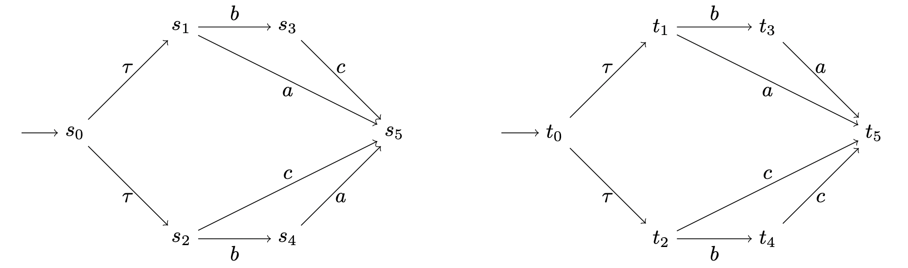
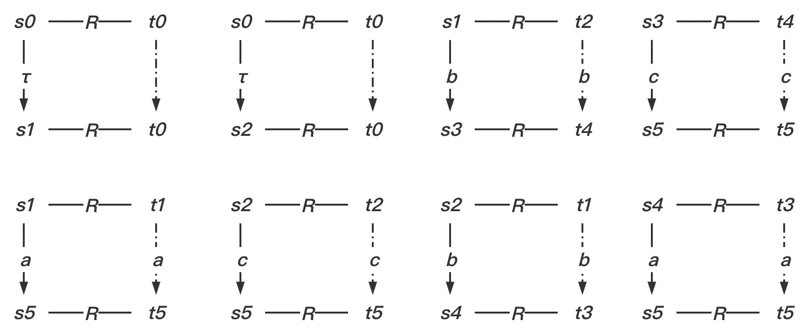
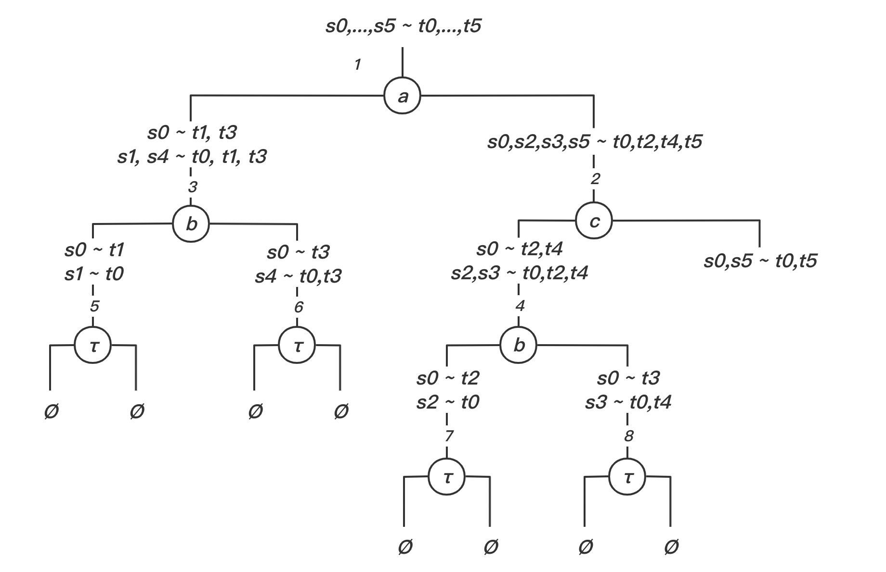

### TD 2. Systèmes de transitions. (Bi)simulation faible.

#### Exercice 1

Prouvez, en exhibant à chaque fois une relation de simulation faible que : 

- $\mathcal{S}$ simule faiblement $\mathcal{T}$ .
- $\mathcal{T}$ simule faiblement $\mathcal{S}$.

$\mathcal{S}$ et $\mathcal{T}$ sont ils faiblement bisimilaires ? Justifiez votre affirmation.

1. $\mathcal{S}$ simule faiblement $\mathcal{T}$

   $R = \{ \langle t_0, s_0 \rangle, \langle t_1, s_0 \rangle, \langle t_2, s_0 \rangle, \langle t_3, s_4 \rangle, \langle t_4, s_3 \rangle, \langle t_5, s_5 \rangle\}$

   

2. $\mathcal{T}$ simule faiblement $\mathcal{S}$

   $R = \{ \langle s_0, t_0 \rangle, \langle s_1, t_0 \rangle, \langle s_2, t_0 \rangle, \langle s_3, t_4 \rangle, \langle s_4, t_3 \rangle, \langle s_5, t_5 \rangle\}$

   

le plus grande relation de bisimulation entre $\mathcal{S}$ et  $\mathcal{T}$ est $R = \{<s_3, t_4>, <t_4,s_3>, <s_5, t_5>,  <t_5, s_5>, <s_4, t_3>, <t_3,s_4>\}$ or$<s0,t0> \notin R$ , they are not bisimulation

Exercice 2

- $R = \{<p_0, q_0>, <p_0, q_4>, <p_1, q_1>, <p_1, q_2>, <p_2, q_3>\}$

$\mathcal{P}$ and $\mathcal{Q}$ is bisimulation + $\mathcal{P}$ and $\mathcal{Q}$ is bisimulation