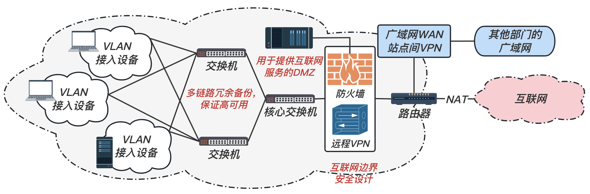
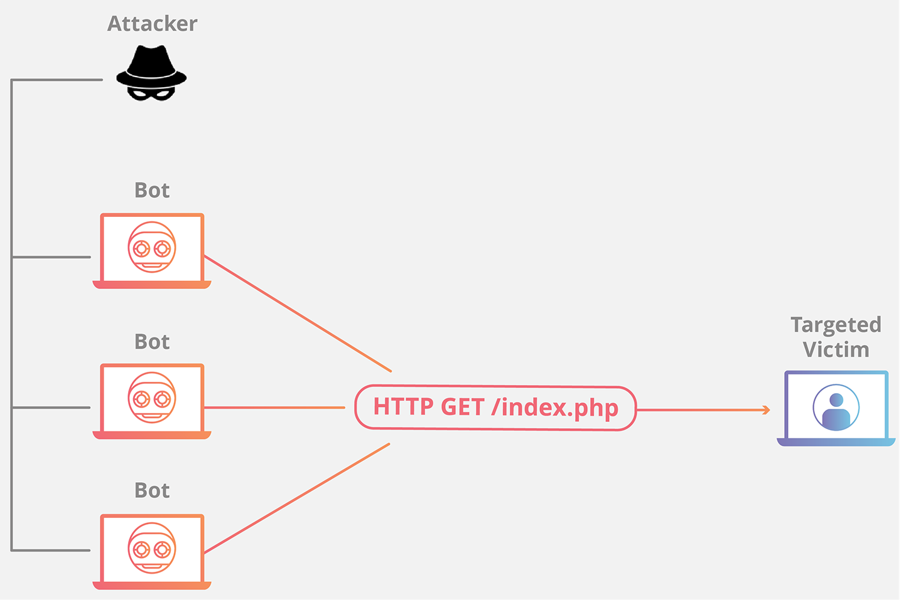
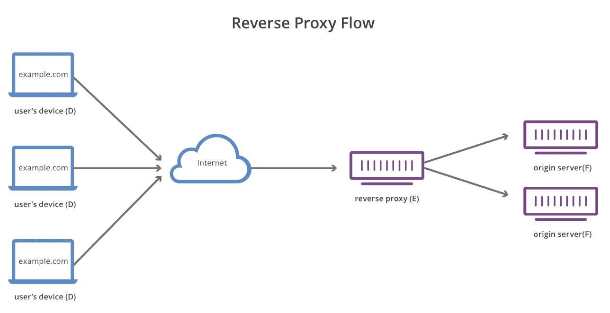
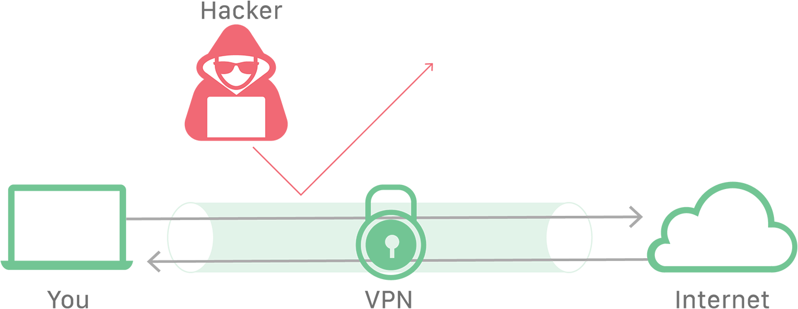
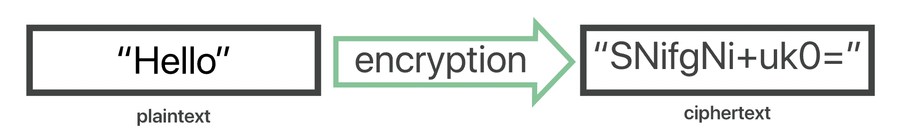

信息安全的要素：

- 保密性（Confidentiality）：保证信息不被泄漏给未经授权的人，即使信息被截获，其表达的信息也不被非授权者所理解 $\to$ <u>***加密***</u>。
- 完整性（Integrity）：防止信息被未经授权的人篡改。
- 可用性（Availability）：确保信息能被授权用户正常使用。
- 可控性
- 不可否认性：对出现的安全问题提供调查的依据和手段。查处恶意者。

对风险的应对：防御、检测、响应

---

在不考虑与互联网通信的完全封闭内部网时，我们需要考虑：

- 对于不同的工作人员分配不同的身份识别，应对其进行严格的访问控制；对于核心的重要敏感信息（企业内管理系统、数据库等）需要更加严格的身份识别、多因素身份验证。
- 对于不同的部门分配不同的子网划分，并在子网中继续划分 VLAN，这样可以控制访问、降低域内广播对于带宽的无效占用，以及缩小 ARP 类型攻击的受害范围；
- 在内网内也需要对于传送的信息进行加密，以防信息的泄漏；
- 对于所有部分（至少是重要的部分）都需要日志来记录所有用户的行为，为事后错误排查提供线索


---



如上图，在互联网边界可能存在如下安全风险：

- 来自互联网的 DoS 攻击（策略：<u>***Anti-DDoS、WAF***</u>）；
- HTTP 协议传输中明文的加密问题（策略：<u>***HTTPS TLS/SSL***</u>）；
- 如果存在 Web 应用，则需要考虑各种非法信息的注入问题，如 SQL 注入、XSS 等（策略：排查代码，<u>***验证输入输出***</u>）
- 对于不同的 VPN 用户，应该也对其 VPN 的访问进行更加细粒度的控制（策略：<u>***配置不同的 VPN***</u>）
- ......

---

关于密码：

- 如果攻击者采取暴力破解，我们可以设置尝试次数，输入密码超过一定次数后封锁账号
- 定期更改密码、不要设置简单密码
- 对于高权限账户，需要多因素身份验证 ，避免单一验证失效后造成大规模损失

---

拥有远程员工的企业应如何确保数据安全？

- <u>***保护传输中和静止的数据***</u>。[访问控制](https://www.cloudflare.com/learning/access-management/what-is-access-control/)和[加密](https://www.cloudflare.com/learning/ssl/what-is-encryption/)是保护数据的关键技术，此外，通过网络（包括互联网）传递的数据应使用[HTTPS](https://www.cloudflare.com/learning/ssl/what-is-https/)、VPN 或其他方法进行加密。

  > <u>***Protect data both in transit and at rest.***</u> [Access control](https://www.cloudflare.com/learning/access-management/what-is-access-control/) and [encryption](https://www.cloudflare.com/learning/ssl/what-is-encryption/) are the key technologies for protecting data. Additionally, data passing over networks, including the Internet, should be encrypted with [HTTPS](https://www.cloudflare.com/learning/ssl/what-is-https/), a VPN, or another method.

- <u>***保护员工端点***</u>。必须保护远程员工[端点](https://www.cloudflare.com/learning/security/glossary/what-is-endpoint/)设备以防网络攻击，因为[恶意软件](https://www.cloudflare.com/learning/ddos/glossary/malware/)感染可能会导致数据泄露。至少应在设备上安装反恶意软件。设备遗失甚至更为常，这也是设备加密异常重要的另一个原因。

  > <u>***Protect employee endpoints***</u>. Remote worker endpoint devices must be protected against cyberattacks, as malware infections can lead to data breaches. At a minimum, anti-malware software should be installed on the device. Lost devices are even more common, which is another reason why device encryption is so important.

- <u>***防范网络钓鱼攻击等账户接管行为***</u>。公司必须执行严格的密码策略。应当无人能够猜出任何员工的密码，而且密码应能够承受大多数[机器人](https://www.cloudflare.com/learning/bots/what-is-a-bot/)攻击。若有可能，企业应对使用的每个公司应用程序实施[双因素身份验证](https://www.cloudflare.com/learning/access-management/what-is-two-factor-authentication/)。

  > <u>***Protect against phishing attacks and other forms of account takeover.***</u> Companies must enforce a strong password policy. No one should be able to guess any employee's password, and the password should be able to withstand most [bot](https://www.cloudflare.com/learning/bots/what-is-a-bot/) attacks. If possible, businesses should implement [two-factor authentication](https://www.cloudflare.com/learning/access-management/what-is-two-factor-authentication/) on every corporate application in use.

## DoS

### 什么是 DDoS 攻击？

分布式拒绝服务（DDoS）攻击是通过大规模互联网流量淹没目标服务器或其周边基础设施，以破坏目标服务器、服务或网络正常流量的恶意行为。

> A distributed denial-of-service (DDoS) attack is a malicious attempt to disrupt the normal traffic of a targeted server, service or network by overwhelming the target or its surrounding infrastructure with a flood of Internet traffic.

DDoS 攻击利用多台受损计算机系统作为攻击流量来源以达到攻击效果。利用的机器可以包括计算机，也可以包括其他联网资源（如 IoT 设备）。

> DDoS attacks achieve effectiveness by utilizing multiple compromised computer systems as sources of attack traffic. Exploited machines can include computers and other networked resources such as IoT devices.

总体而言，DDoS 攻击好比高速公路发生交通堵塞，妨碍常规车辆抵达预定目的地。

### DDoS 攻击的工作原理

DDoS 攻击是通过连接互联网的计算机网络进行的。

> DDoS attacks are carried out with networks of Internet-connected machines.

这些网络由计算机和其他设备（例如 IoT 设备）组成，它们感染了恶意软件，从而被攻击者远程控制。这些个体设备称为机器人（或僵尸），一组机器人则称为僵尸网络。

> These networks consist of computers and other devices (such as IoT devices)which have been infected with malwares, allowing them to be controlled remotely by an attacker. These individual devices are referred to as bots (or zombies), and a group of bots is called a botnet.

一旦建立了僵尸网络，攻击者就可通过向每个机器人发送远程指令来发动攻击。

> Once a botnet has been established, the attacker is able to direct an attack by sending remote instructions to each bot.

当僵尸网络将受害者的服务器或网络作为目标时，每个机器人会将请求发送到目标的 IP 地址，这可能导致服务器或网络不堪重负，从而造成对正常流量的拒绝服务。

> When a victim’s server or network is targeted by the botnet, each bot sends requests to the target’s IP address, potentially causing the server or network to become overwhelmed, resulting in a denial-of-service to normal traffic.

由于每个机器人都是合法的互联网设备，因而可能很难区分攻击流量与正常流量。

> Because each bot is a legitimate Internet device, separating the attack traffic from normal traffic can be difficult.


### 应用程序层DDoS攻击

#### 攻击目标

此类攻击有时称为第 7 层 DDoS 攻击（指 OSI 模型第 7 层），其目标是耗尽目标资源。

> Sometimes referred to as a Application Layer DDoS attack (in reference to the 7th layer of the OSI model), the goal of these attacks is to exhaust the target’s resources to create a denial-of-service.

攻击目标是生成网页并传输网页响应 HTTP 请求的服务器层。在客户端执行一项 HTTP 请求的计算成本比较低，但目标服务器做出响应却可能非常昂贵，因为服务器通常必须加载多个文件并运行数据库查询才能创建网页。

> The attacks target the layer where web pages are generated on the server and delivered in response to HTTP requests. A single HTTP request is computationally cheap to execute on the client side, but it can be expensive for the target server to respond to, as the server often loads multiple files and runs database queries in order to create a web page.

第 7 层攻击很难防御，因为难以区分恶意流量和合法流量。

> These attacks are difficult to defend against, since it can be hard to differentiate malicious traffic from legitimate traffic.

#### 应用程序层攻击示例



#### HTTP 洪水

HTTP 洪水攻击类似于同时在大量不同计算机的 Web 浏览器中一次又一次地按下刷新 ——大量 <u>***HTTP 请求***</u>涌向服务器，导致拒绝服务。

> HTTP flood attack is similar to pressing refresh in a web browser over and over on many different computers at once – large numbers of <u>***HTTP requests***</u> flood the server, resulting in denial-of-service.

较简单的实现可以使用相同范围的攻击 IP 地址、referrer 和用户代理访问一个 URL。复杂版本可能使用大量攻击性 IP 地址，并使用随机 referrer 和用户代理来针对随机网址。

> Simpler implementations may access one URL with the same range of attacking IP addresses, referrers and user agents. Complex versions may use a large number of attacking IP addresses, and target random urls using random referrers and user agents.

【2 种 HTTP 洪水攻击】

- HTTP GET 攻击：使用大量 `GET` 请求向服务器请求图片等大尺寸资源
- HTTP POST 攻击：大量 `POST` 请求向服务器提交表单（post form），服务器因为持久化（persistent）操作而耗费大量资源

【防护方法】

- 以测试它是否是[机器人](https://www.cloudflare.com/learning/bots/what-is-a-bot/)，这与在线创建帐户时常用的 CAPTCHA 测试非常相似。
- 使用 [Web 应用程序防火墙 (WAF)](https://www.cloudflare.com/learning/ddos/glossary/web-application-firewall-waf/) 等。

### 协议DDoS攻击

#### 攻击目标

协议攻击也称为状态耗尽攻击，这类攻击会过度消耗服务器资源和（或）防火墙和负载平衡器之类的网络设备资源，从而导致服务中断。

> Protocol attacks, also known as a state-exhaustion attacks, cause a service disruption by over-consuming server resources and/or the resources of network equipment like firewalls and load balancers.

协议攻击利用协议堆栈第 3 层和第 4 层的弱点致使目标无法访问。

> Protocol attacks utilize weaknesses in layer 3 and layer 4 of the protocol stack to render the target inaccessible.

#### 协议攻击示例


#### SYN 洪水

SYN 洪水攻击利用 TCP 握手，通过向目标发送大量带有伪造源 IP 地址的 TCP“初始连接请求”SYN 数据包来实现。

> A SYN flood attack exploits the TCP handshake by sending a target a large number of TCP “Initial Connection Request” SYN packets with spoofed source IP addresses.

目标计算机响应每个连接请求，然后等待握手中的最后一步，但这一步确永远不会发生，因此在此过程中耗尽目标的资源。

> The target machine responds to each connection request and then waits for the final step in the handshake, which never occurs, exhausting the target’s resources in the process.

1. 攻击者通常使用[伪造的](https://www.cloudflare.com/learning/ddos/glossary/ip-spoofing/) IP 地址向目标服务器发送大量 SYN 数据包。
2. 然后，服务器分别对每一项连接请求做出响应，并确保打开的端口做好接收响应的准备。
3. 在服务器等待最后一个 ACK 数据包（永远不会到达）的过程中，攻击者将继续发送更多 SYN 数据包。每当有新的 SYN 数据包到达，服务器都会临时打开一个新的端口并在一段特定时间内保持连接；用遍所有可用端口后，服务器将无法正常运行。

【缓解方法】

- 扩展积压工作队列 Increasing Backlog queue
- 回收最先创建的 TCP 半开连接 Recycling the Oldest Half-Open TCP connection
- SYN Cookie

### 容量耗尽攻击

#### 攻击目标

此类攻击试图通过消耗目标与较大的互联网之间的所有可用带宽来造成拥塞。攻击运用某种放大攻击或其他生成大量流量的手段（如僵尸网络请求），向目标发送大量数据。

> This category of attacks attempts to create congestion by consuming all available bandwidth between the target and the larger Internet. Large amounts of data are sent to a target by using a form of amplification or another means of creating massive traffic, such as requests from a botnet.

#### DNS 放大


利用伪造的 IP 地址（受害者的 IP 地址）向开放式 [DNS 服务器](https://www.cloudflare.com/learning/ddos/glossary/domain-name-system-dns/)发出请求后，目标 IP 地址将收到服务器发回的响应。

> By making a request to an open [DNS](https://www.cloudflare.com/learning/ddos/glossary/domain-name-system-dns/) server with a spoofed IP address (the IP address of the victim), the target IP address then receives a response from the server.

DNS 放大可分为四个步骤：

1. 攻击者使用受损的端点将有欺骗性 IP 地址的 [UDP](https://www.cloudflare.com/learning/ddos/glossary/user-datagram-protocol-udp/) 数据包发送到 DNS 递归服务器。数据包上的欺骗性地址指向受害者的真实 IP 地址。
2. 每个 UDP 数据包都向 DNS 解析器发出请求，通常传递一个参数（例如“ANY”）以接收尽可能最大的响应。
3. DNS 解析器收到请求后，会向欺骗性 IP 地址发送较大的响应。
4. 目标的 IP 地址接收响应，其周边的网络基础设施被大量流量淹没，从而导致拒绝服务。

尽管少量请求不足以导致网络基础设施下线，但在这一过程通过多个请求和 DNS 解析器翻倍后，目标最终接收的数据量变得非常大。


### 如何防护 DDoS 攻击？

若要缓解 DDoS 攻击，关键在于<u>***区分攻击流量与正常流量***</u>。

> The key concern in mitigating a DDoS attack is differentiating between attack traffic and normal traffic.

#### 速率限制

限制服务器在某个时间段接收的请求数量也是防护拒绝服务攻击的一种方法。

> Limiting the number of requests a server will accept over a certain time window is also a way of mitigating denial-of-service attacks.

虽然速率限制对于减缓 Web 爬虫窃取内容及防护[暴力破解](https://www.cloudflare.com/learning/bots/brute-force-attack/)攻击很有帮助，但仅靠速率限制可能不足以有效应对复杂的 DDoS 攻击。

> While rate limiting is useful in slowing web scrapers from stealing content and for mitigating [brute force](https://www.cloudflare.com/learning/bots/brute-force-attack/) login attempts, it alone will likely be insufficient to handle a complex DDoS attack effectively.

#### Web 应用程序防火墙

[Web 应用程序防火墙（WAF）](https://www.cloudflare.com/learning/ddos/glossary/web-application-firewall-waf/) 是一种有效工具，有助于缓解第 7 层 DDoS 攻击。在互联网和源站之间部署 WAF 后，WAF 可以充当[反向代理](https://www.cloudflare.com/learning/cdn/glossary/reverse-proxy/)，保护目标服务器，防止其遭受特定类型的恶意流量入侵。

> A [Web Application Firewall (WAF)](https://www.cloudflare.com/learning/ddos/glossary/web-application-firewall-waf/) is a tool that can assist in mitigating a layer 7 DDoS attack. By putting a WAF between the Internet and an origin server, the WAF may act as a [reverse proxy](https://www.cloudflare.com/learning/cdn/glossary/reverse-proxy/), protecting the targeted server from certain types of malicious traffic.

通过基于一系列用于识别 DDoS 工具的规则过滤请求，可以阻止第 7 层攻击。有效的 WAF 的一个关键价值是能够[快速实施自定义规则](https://developers.cloudflare.com/firewall/)以应对攻击。

> By filtering requests based on a series of rules used to identify DDoS tools, layer 7 attacks can be impeded. One key value of an effective WAF is the ability to [quickly implement custom rules](https://developers.cloudflare.com/firewall/) in response to an attack.

#### Anycast 网络扩散

此类缓解方法使用 Anycast 网络，将攻击流量分散至分布式服务器网络，直到网络吸收流量为止。

> This mitigation approach uses an Anycast network to scatter the attack traffic across a network of distributed servers to the point where the traffic is absorbed by the network.

这种方法可以将分布式攻击流量的影响分散到可以管理的程度，从而分散破坏力。

> This approach spreads the impact of the distributed attack traffic to the point where it becomes manageable, diffusing any disruptive capability.

[Anycast 网络](https://www.cloudflare.com/learning/cdn/glossary/anycast-network/)在缓解 DDoS 攻击方面的可靠性取决于攻击规模及网络规模和效率。

> The reliability of an [Anycast network](https://www.cloudflare.com/learning/cdn/glossary/anycast-network/) to mitigate a DDoS attack is dependent on the size of the attack and the size and efficiency of the network.


## Web 应用程序安全

Web 应用程序安全是<u>***保护网站、应用程序和 API 免受攻击***</u>的做法。这是一门广泛的学科，但其最终目标是保持 Web 应用程序平稳运行，并保护企业免受网络破坏、数据盗窃、不道德竞争和其他负面后果的影响。

> Web application security is the practice of protecting <u>***websites***</u>, <u>***applications***</u>, and <u>***APIs***</u> from attacks. 

互联网的全球性使 Web 应用程序和 API 暴露于来自许多位置以及各种规模和复杂性级别的攻击。因此，Web 应用程序安全包含多种策略，涵盖软件供应链的许多部分。

Web 应用程序可能面临多种攻击类型，具体取决于攻击者的目标、目标组织的工作性质以及应用程序的特定安全漏洞。常见的攻击类型包括：

### SQL 注入

SQL 注入通过在输入字段中插入专用的 SQL 语句，攻击者可以执行命令，以允许从数据库中检索数据、破坏敏感数据或执行其他操纵行为。

> By inserting specialized SQL statements into an entry field, a SQL injection attacker is able to execute commands that allow for the retrieval of data from the database, the destruction of sensitive data, or other manipulative behaviors.

通过正确执行 SQL 命令，未经授权的用户可以伪造特权更高的用户的身份，使自己或其他人成为数据库管理员，篡改现有数据、修改事务和余额以及检索和/或销毁所有服务器数据。


#### SQL 注入攻击的工作原理

本应为特定类型的数据（例如数字）保留的 SQL 查询字段传递了意外的信息（例如命令）。该命令在运行时越过预期的范围，从而允许可能有害的行为。查询字段通常由在网页上输入表单的数据填充。

> A SQL query field that is supposed to be reserved for a particular type of data, such as a number is instead passed unexpected information, such as a command. The command, when run, escapes beyond the intended confines, allowing for potentially nefarious behavior. A query field is commonly populated from data entered into a form on a webpage.

我们来简单比较一下普通和恶意 SQL 语句：

##### 普通 SQL 查询

我们假设在前端页面提供一个对学生 ID 号码查询的接口，从而返回这个学生的所有信息。如下所示

<table align="center">
<tr>
<td align="center">
<form name="age">
请输入需要查询的学生 ID: <input type="text" name="age" value="12345678" placeholder="输入ID">
</td>
<td align="center"><input type="button" value="搜索"></td>
</tr>
</table>

其在后端生成的 SQL 查询将类似于：

```sql
SELECT * FROM t_stundents WHERE student_id = 12345678;
```

此命令将返回具有特定 `student_id` 的学生的记录，这也是符合编写 API 的开发人员期望的。

##### SQL 注入查询：

在上面的例子中，攻击者在输入字段中输入 SQL 命令或条件逻辑，他输入的学生 ID 编号为：

<table align="center">
<tr>
<td align="center">
<form name="age">
请输入需要查询的学生 ID: <input type="text" name="age" value="12345678 OR 1=1" placeholder="输入ID">
</td>
<td align="center"><input type="button" value="搜索"></td>
</tr>
</table>

相同的，其在后端生成的 SQL 查询将类似于：

```sql
SELECT * FROM t_stundents WHERE student_id = 12345678 OR 1=1;
```

由于查询条件中的 `1=1` 始终为 `TRUE`，所以该条查询语句会将 `t_students` 表中所有数据都返回给进行查询的攻击者。


#### 如何防止 SQL 注入攻击？

应用程序消费的任何东西，如果来自外部（不直接和专门由应用程序控制的，如文件系统、数据库），在<u>***消费前必须经过验证***</u>。

我们来探索一些比较常见的实施：

- 【对所有用户提供的输入进行<u>***转义***</u>】Escape All User Supplied Input：

  编写 SQL 时，特定字符或单词具有特定含义。例如，“`*`”字符表示“任意”，而“`OR`”表示条件性。为了避免用户意外地或恶意地将这些字符输入数据库的 API 请求中，可以对用户提供的输入进行转义。对字符转义是告诉数据库不要将其解析为命令或条件、而是将其视为文字输入的方式。

- 【使用准备好的语句（带有参数化查询）】Use of Prepared Statements (with Parameterized Queries)：

  这种清理数据库输入的方法需要强制开发人员首先定义所有 SQL 代码，然后仅将特定参数传递给 SQL 查询；输入的数据明确地给出有限范围，无法扩展。这使数据库可以区分输入的数据和要运行的代码，而无论输入字段中提供的数据类型如何。


### 跨站点脚本 (XSS)

#### 什么是跨站点脚本？

跨站点脚本 (XSS) 是一种漏洞利用，攻击者将代码附加到合法网站上，当受害者加载网站时，代码就会执行。

> Cross-site scripting (XSS) is an exploit where the attacker attaches code onto a legitimate website that will execute when the victim loads the website.

恶意代码可以通过几种方式插入。最常见的是添加到 URL 的末尾，或者直接发布到显示用户生成的内容的页面上。用更专业的术语来说，跨站点脚本是一种客户端代码注入攻击。

> That malicious code can be inserted in several ways. Most popularly, it is either added to the end of a url or posted directly onto a page that displays user-generated content. In more technical terms, cross-site scripting is a client-side code injection attack.


#### XSS 如何攻击

跨站点脚本攻击常见于<u>***没有验证的、带有评论功能的网站***</u>。在这种情况下，攻击者发布一条<u>***包含 `<script>脚本代码</script>` 标记的评论***</u>。这些标记告诉 Web 浏览器将 `<script>` 标记之间的所有内容解释为 JavaScript 代码。评价出现在页面上之后，任何其他用户加载网站时，其 Web 浏览器将执行脚本标记之间的恶意代码，而用户则成为攻击的受害者。

> One useful example of cross-site scripting attacks is commonly seen on websites that have unvalidated comment forums. In this case, an attacker will post a comment consisting of executable code wrapped in `<script>` tags. These tags tell a web browser to interpret everything between the tags as JavaScript code. Once that comment is on the page, when any other user loads that website, the malicious code between the script tags will be executed by their web browser, and they will become a victim of the attack.


#### 反射式 XSS

这是最常见的跨站点脚本攻击。通过反射攻击，恶意代码被添加到网站 URL 的末尾。当受害者在 Web 浏览器中加载此链接时，浏览器将执行注入到 url 中的代码。

> This is the most commonly seen cross-site scripting attack. With a reflected attack, malicious code is added onto the end of the url of a website. When the victim loads this link in their web browser, the browser will execute the code injected into the url. The attacker usually uses some form of social engineering to trick the victim into clicking on the link.

1. 攻击者伪装银行人员发布一条带有钓鱼脚本的连接（反射式），如下所示

   > The attacker pretends to be a banker and publishes a connection with a malicious script

   ```
   http://example.bank.com/index.html?uesr=<script>这里是恶意代码片段</script>
   ```

2. 当受害者点击链接后，`<script>` 标记内的恶意代码也被执行

   > When the victim clicks on the link, the malicious code inside the `<script>` tag is also executed


#### 持久性 XSS

持久性跨站点脚本发生在允许用户发布其他用户将看到的内容的网站上，例如评论论坛或社交媒体网站。如果站点未正确验证用户生成的内容，则攻击者可能插入页面加载时其他用户的浏览器将执行的代码。

> ***Persistent cross-site scripting*** happens on sites that let users post content that other users will see, such as a comments forum or social media site, for example. If the site doesn’t properly validate the inputs for user-generated content, an attacker can insert code that other users’ browsers will execute when the page loads.

例如，攻击者在自己的个人资料中包含以下内容：

```
"你好，我是xxx，我来自xxx，<script>这里是恶意代码片段</script>"
```

任何试图访问这个个人资料的用户都将成为攻击者的持久性跨站点脚本攻击的受害者。


#### 如何防止 XSS

- 【<u>***验证输入***</u>】Validating inputs：验证表示实施规则，以防止用户将数据发布到不符合特定条件的表单中。例如，要求用户输入“姓氏”的输入应具有验证规则，仅允许用户提交由字母数字字符组成的数据。验证规则也可以设置为拒绝跨站点脚本中常用的任何标记或字符，例如 `<script>` 标记。

  > Validation means implementing rules that prevent a user from posting data into a form that doesn’t meet certain criteria.
  >
  >  For example, an input that asks for the user’s “Last Name” should have validation rules that only let the user submit data consisting of alphanumeric characters. 

- 【<u>***设置 WAF 规则***</u>】Setting WAF rules：也可以配置为强制执行规则，以防止反射性跨站点脚本。这些 WAF 规则采用的策略将阻止对服务器的奇怪请求，包括跨站点脚本攻击。

  > A [WAF](https://www.cloudflare.com/learning/ddos/glossary/web-application-firewall-waf/) can also be configured to enforce rules which will prevent reflected cross-site scripting. These WAF rules employ strategies that will block strange requests to the server, including cross-site scripting attacks.

### 暴力攻击

暴力攻击是一种试错方法，用于解码敏感数据。暴力攻击最常用于破解密码和加密密钥，暴力破解密码攻击通常是通过脚本或者机器人针对网站登录页面实施的。

暴力攻击与其他破解方法的不同之处在于，蛮力攻击不采用智力策略；他们只是尝试使用不同的字符组合，直到找到正确的组合。

> Brute force attack is a trial and error method used to decode sensitive data. Brute-force attacks are most commonly used to crack passwords and encryption keys. Brute-force password attacks are usually performed by scripts or bots against website login pages.
>
> Brute-force attacks differ from other cracking methods in that brute-force attacks do not employ intellectual strategies; they simply try different combinations of characters until they find the right one.

#### 防范暴力攻击

管理授权系统的开发人员可采取如下措施：

- 如锁定登录失败次数过多的 IP 地址，Locking out IP addresses that have generated too many failed logins

- 以及在密码检查软件中纳入延时机制。即使是数秒延时，也能大大降低暴力攻击的有效性。

  > Incorporating a delay in their password-checking software. A delay of even a few seconds can greatly weaken the effectiveness of a brute force attack.

Web 服务用户可选择更长的复杂密码来降低暴力攻击风险。此外，建议启用[双因素身份验证](https://www.cloudflare.com/learning/access-management/what-is-two-factor-authentication/)，和非机器人验证（如reCAPTCHA）。

> Web service users can choose longer and complex passwords to reduce the risk of brute force attacks. In addition, it is recommended to enable two-factor authentication, and non-robot authentication (such as reCAPTCHA).

### Web 应用程序防火墙 WAF

WAF（Web 应用程序[防火墙](https://www.cloudflare.com/learning/security/what-is-a-firewall/)）通过<u>***过滤和监控 Web 应用程序与互联网之间的 [HTTP](https://www.cloudflare.com/learning/ddos/glossary/hypertext-transfer-protocol-http/) 流量***</u>来帮助保护 Web 应用程序。它通常可以保护 Web 应用程序，使其免受[跨站点伪造](https://www.cloudflare.com/learning/security/threats/cross-site-request-forgery/)、[跨站点脚本 (XSS)](https://www.cloudflare.com/learning/security/threats/cross-site-scripting/)、文件包含、[SQL 注入](https://www.cloudflare.com/learning/security/threats/sql-injection/)及其他一些攻击的影响。WAF 属于协议[第 7 层](https://www.cloudflare.com/learning/ddos/what-is-layer-7/)防御策略（[OSI 模型](https://www.cloudflare.com/learning/ddos/glossary/open-systems-interconnection-model-osi/)中），并不能抵御所有类型的攻击。此攻击缓解方法通常隶属于一套工具，整套工具共同针对一系列攻击手段建立整体防御措施。

> A WAF or web application [firewall](https://www.cloudflare.com/learning/security/what-is-a-firewall/) helps protect web applications by filtering and monitoring [HTTP](https://www.cloudflare.com/learning/ddos/glossary/hypertext-transfer-protocol-http/) traffic between a web application and the Internet. It typically protects web applications from attacks such as [cross-site forgery](https://www.cloudflare.com/learning/security/threats/cross-site-request-forgery/), [cross-site-scripting (XSS)](https://www.cloudflare.com/learning/security/threats/cross-site-scripting/), file inclusion, and [SQL injection](https://www.cloudflare.com/learning/security/threats/sql-injection/), among others. A WAF is a protocol [layer 7](https://www.cloudflare.com/learning/ddos/what-is-layer-7/) defense (in the [OSI model](https://www.cloudflare.com/learning/ddos/glossary/open-systems-interconnection-model-osi/)), and is not designed to defend against all types of attacks. This method of attack mitigation is usually part of a suite of tools which together create a holistic defense against a range of attack vectors.


通过在 Web 应用程序前端部署 WAF，可在 Web 应用程序与 Internet 之间形成一道屏障。WAF 是一种[反向代理](https://www.cloudflare.com/learning/cdn/glossary/reverse-proxy/)，引导客户端通过 WAF 到达服务器，从而防止暴露服务器。

> By deploying a WAF in front of a web application, a shield is placed between the web application and the Internet. A WAF is a type of [reverse-proxy](https://www.cloudflare.com/learning/cdn/glossary/reverse-proxy/), protecting the server from exposure by having clients pass through the WAF before reaching the server.

#### 反向代理

反向代理是位于一个或多个 Web 服务器前面的服务器，拦截来自客户端的请求。使用反向代理，当客户端将请求发送到网站的源服务器时，反向代理服务器会在[网络边缘](https://www.cloudflare.com/learning/serverless/glossary/what-is-edge-computing/)拦截这些请求。然后，反向代理服务器将向源服务器发送请求并从源服务器接收响应。

> A reverse proxy is a server that sits in front of one or more web servers, intercepting requests from clients.With a reverse proxy, when clients send requests to the origin server of a website, those requests are intercepted at the [network edge](https://www.cloudflare.com/learning/serverless/glossary/what-is-edge-computing/) by the reverse proxy server. The reverse proxy server will then send requests to and receive responses from the origin server.



下面是反向代理的一些好处：

- **[【负载均衡】](https://www.cloudflare.com/learning/cdn/cdn-load-balance-reliability/)**：一个百万级用户可能无法使用单个源服务器处理所有传入站点流量。但该站点可以分布在不同服务器的池中，让所有服务器都处理同一站点的请求。在这种情况下，反向代理可以提供一种负载均衡解决方案，在不同服务器之间平均分配传入流量，以防止单个服务器过载。如果某台服务器完全无法运转，则其他服务器可以代为处理流量。
- 【防范攻击】：配备反向代理后，网站或服务无需透露其源服务器的 IP 地址。这使得攻击者更难利用针对性攻击，例如 [DDoS 攻击](https://www.cloudflare.com/learning/ddos/what-is-a-ddos-attack/)。
- 【缓存】：反向代理还可以[缓存](https://www.cloudflare.com/learning/cdn/what-is-caching/)内容，从而提高速度。如果用户遍布全球，那么距离源服务器较远的用户在连接服务器时会很缓慢。可以使用缓存来部分加速访问速度，或者直接使用 CDN。
- 【SSL 加密】：[加密](https://www.cloudflare.com/learning/ssl/what-is-encryption/)和解密每个客户端的 [SSL](https://www.cloudflare.com/learning/security/glossary/what-is-ssl/)（或 [TLS](https://www.cloudflare.com/learning/security/glossary/transport-layer-security-tls/)）通信对于源服务器可能需要耗费大量计算资源。可以配置由反向代理解密所有传入请求并加密所有传出响应，腾出源服务器上的宝贵资源。


## VPN

### VPN

通常，大多数 Internet 流量是未加密的并且非常公开。当用户创建 Internet 连接时，用户的设备会连接到其 Internet 服务提供商（ISP），然后 ISP 连接到 Internet 以查找适当的 Web 服务器，并与之通信来获取请求的网站。

> Ordinarily, most Internet traffic is unencrypted and very public. When a user creates an Internet connection, the user’s device will connect to their ISP, and then the ISP will connect to the Internet to find the appropriate web server to communicate with to fetch the request website.

用户的 [IP 地址](https://www.cloudflare.com/learning/ddos/glossary/tcp-ip/)在整个过程中都是公开的，ISP 和任何其他中介都可以保留用户浏览习惯的记录。此外，用户设备和 Web 服务器之间交换的数据未经过加密，此时攻击者就可以监听到这些数据，例如[在途攻击](https://www.cloudflare.com/learning/security/threats/on-path-attack/)。

> The user's IP address is public throughout, and ISPs and any other intermediaries can keep records of the user's browsing habits. Additionally, the data exchanged between the user device and the web server is not encrypted, allowing an attacker to listen to the data

虚拟专用网络 (VPN) 是一种互联网安全服务，使用户可以像连接专用网络一样访问互联网。这不仅能加密互联网通信，还能提供高度匿名性。人们使用 VPN 的一些最常见原因是为了防止公共 WiFi 上的监听、规避互联网审查，或连接公司内部网络以实现远程办公。

> A virtual private network (VPN) is an Internet security service that allows users to access the Internet as though they were connected to a private network. This encrypts Internet communications as well as providing a strong degree of anonymity. Some of the most common reasons people use VPNs are to protect against snooping on public WiFi, to circumvent Internet censorship, or to connect to a business’s internal network for the purpose of remote work.



#### VPN 如何工作？

使用 VPN 服务连入 Internet 的用户具有更高级别的安全性和隐私性。VPN 连接涉及以下四个步骤：

1. VPN 客户端使用加密连接与 ISP 连接。
2. ISP 将 VPN 客户端连接到 VPN 服务器，并且维护加密连接。
3. VPN 服务器解密来自用户设备的数据，然后以未加密的通信连接到 Internet 来访问 Web 服务器。
4. VPN 服务器与客户端建立一种称为“VPN 隧道”的加密连接。

VPN 客户端和 VPN 服务器之间的 ***VPN 隧道***会经过 ISP，但由于所有数据都已加密，ISP 无法查看用户的活动。VPN 服务器与互联网的通信未经过加密，但 Web 服务器仅会记录 VPN 服务器的 IP 地址，因而无法获得用户的信息。

> The <u>***VPN tunnel***</u> between the VPN client and VPN server passes through the ISP, but since all the data is encrypted, the ISP cannot see the user’s activity. The VPN server’s communications with the Internet are unencrypted, but the web servers will only log the IP address of the VPN server, which gives them no information about the user.

#### VPN 优点

- 【<u>***公共 WiFi 网络防护***</u>】：直接使用公共 WiFi 网络的用户流量未经过加密，同一网络上的其他用户可以使用易于获得的工具来监视其活动。如果用户通过 VPN 连接，则窃听攻击者只能看到加密后的数据，不会泄露任何敏感信息。

  > User traffic directly using public WiFi networks is not encrypted, and other users on the same network can use readily available tools to monitor their activity. If the user is connected through a VPN, the snooping attacker can only see the encrypted data without revealing any sensitive information

- 【<u>***远程办公***</u>】：许多企业允许其员工使用 VPN 进行远程办公。这不仅能让远程员工[访问](https://www.cloudflare.com/learning/access-management/what-is-access-control/)公司内部网络，也提供了加密功能来保护企业免受攻击者的侵害。

  > Many businesses allow their employees to work remotely using a VPN. This can allow the remote employee to have [access](https://www.cloudflare.com/learning/access-management/what-is-access-control/) to the company’s internal network, as well as provide encryption to protect the business from attackers.

- 【<u>***[访问控制](https://www.cloudflare.com/zh-cn/learning/access-management/what-is-access-control/)***</u>】：控制哪些用户有权访问哪些资源。公司设置几个不同的 VPN，每个 VPN 连接到不同的内部资源。通过将用户分配至这些 VPN，不同的用户便可具有不同级别的数据访问权限。

  访问控制和管理对于保护公司数据安全至关重要。若无访问控制，未经授权的用户可能会查看或更改机密数据，从而导致[数据泄露](https://www.cloudflare.com/learning/security/what-is-a-data-breach/)。

  > This can control which users have access to which resources. The company sets up several different VPNs, and each VPN connects to different internal resources. By assigning users to these VPNs, different users can have different levels of access to data.
  >
  > Access control and management is crucial for protecting and securing corporate data. Without access control, unauthorized users could view or alter confidential data, resulting in a [data breach](https://www.cloudflare.com/learning/security/what-is-a-data-breach/).


## 加密

加密是扰乱数据以便只有授权方才能理解信息的一种方式。从技术上讲，它是将人类可读的明文转换为不可理解文本（也称为密文）的过程。简单地说，加密接受可读的数据并对其进行修改，以使其看起来是随机的。加密需要使用[密钥](https://www.cloudflare.com/learning/ssl/what-is-a-cryptographic-key/)：加密消息的发件人和收件人约定的一组数学值。

> Encryption is a way of scrambling data so that only authorized parties can understand the information. In technical terms, it is the process of converting human-readable plaintext to incomprehensible text, also known as ciphertext. In simpler terms, encryption takes readable data and alters it so that it appears random. Encryption requires the use of a [cryptographic key](https://www.cloudflare.com/learning/ssl/what-is-a-cryptographic-key/): a set of mathematical values that both the sender and the recipient of an encrypted message agree on.



尽管加密数据看起来是随机的，但加密是以一种逻辑的、可预测的方式进行的，因此接收加密数据并拥有正确密钥的一方可以解密数据，将其变回明文。

> Although encrypted data appears random, encryption proceeds in a logical, predictable way, allowing a party that receives the encrypted data and possesses the right key to decrypt the data, turning it back into plaintext.

【<u>***加密密钥***</u>】是加密算法中用于更改数据而使用的字符串，以便使其看起来是随机的。就像实体钥匙一样，它锁定（加密）数据，以便只有拥有相匹配的钥匙的人才能解锁（解密）数据。

> A <u>***cryptographic key***</u> is a string of characters used within an encryption algorithm for altering data so that it appears random. Like a physical key, it locks (encrypts) data so that only someone with the right key can unlock (decrypt) it.

【两种主要的加密】

- 对称加密：只有一个密钥，所有通信方都使用相同的（秘密）密钥进行加密和解密。

  > In symmetric encryption, there is only one key, and all communicating parties use the same (secret) key for both encryption and decryption.

  - 常用的对称加密算法包括：AES、3-DES、SNOW

- [非对称加密](https://www.cloudflare.com/learning/ssl/what-is-asymmetric-encryption/)：非对称加密也称为[公钥加密](https://www.cloudflare.com/learning/ssl/how-does-public-key-encryption-work/)。在非对称或公钥加密中，有两个密钥：一个用于加密，另一个用于解密。解密密钥是保密的（因此称为“私钥”），而加密密钥是公开的，供任何人使用（因此称为“公钥”）。非对称加密是 [TLS](https://www.cloudflare.com/learning/ssl/transport-layer-security-tls/)（通常称为 [SSL](https://www.cloudflare.com/learning/ssl/what-is-ssl/)）的基础技术。

  > In asymmetric, or public key, encryption, there are two keys: one key is used for encryption, and a different key is used for decryption. The decryption key is kept private (hence the "private key" name), while the encryption key is shared publicly, for anyone to use (hence the "public key" name). Asymmetric encryption is a foundational technology for [TLS](https://www.cloudflare.com/learning/ssl/transport-layer-security-tls/) (often called [SSL](https://www.cloudflare.com/learning/ssl/what-is-ssl/)).

  - 常用的非对称加密算法包括：RSA、椭圆曲线加密（Elliptic curve cryptography）

### HTTPS 加密

加密是各种技术的基础，但对于保证 [HTTP ](https://www.cloudflare.com/learning/ddos/glossary/hypertext-transfer-protocol-http/)请求和响应的安全尤为重要。负责此功能的协议称为 [HTTPS](https://www.cloudflare.com/learning/ssl/what-is-https/)（超文本传输协议安全）。通过 HTTPS 而不是 HTTP 提供服务的网站的 URL 将以 `https://` 开头，而不是 `http://`。

> Encryption is foundational for a variety of technologies, but it is especially important for keeping [HTTP](https://www.cloudflare.com/learning/ddos/glossary/hypertext-transfer-protocol-http/) requests and responses secure. The protocol responsible for this is called [HTTPS](https://www.cloudflare.com/learning/ssl/what-is-https/) (Hypertext Transfer Protocol Secure). A website served over HTTPS instead of HTTP will have a URL that begins with `https://` instead of `http://`


#### HTTPS 如何工作？

HTTPS 使用加密协议对通信进行加密。该协议称为<u>***[传输层安全性 (TLS)](https://www.cloudflare.com/learning/ssl/transport-layer-security-tls/)***</u>，但以前称为[安全套接字层 (SSL)](https://www.cloudflare.com/learning/ssl/what-is-ssl/)。该协议通过使用所谓的[非对称公钥基础架构](https://www.cloudflare.com/learning/ssl/how-does-public-key-encryption-work/)来保护通信。这种类型的安全系统使用两个不同的密钥来加密两方之间的通信：

> HTTPS uses an encryption protocol to encrypt communications. The protocol is called Transport Layer Security (TLS), although formerly it was known as [Secure Sockets Layer (SSL)](https://www.cloudflare.com/learning/ssl/what-is-ssl/). This protocol secures communications by using what’s known as an [asymmetric public key infrastructure](https://www.cloudflare.com/learning/ssl/how-does-public-key-encryption-work/). This type of security system uses two different keys to encrypt communications between two parties:

1. 【私钥】：此密钥由网站所有者控制，并且如读者所推测的那样，它是私有的。此密钥位于 Web 服务器上，用于解密通过公钥加密的信息。

   > this key is controlled by the owner of a website and it’s kept, as the reader may have speculated, private. This key lives on a web server and is used to decrypt information encrypted by the public key.

2. 【公钥】所有想要以安全方式与服务器交互的人都可以使用此密钥。用公钥加密的信息只能用私钥解密。

   > this key is available to everyone who wants to interact with the server in a way that’s secure. Information that’s encrypted by the public key can only be decrypted by the private key.

#### HTTPS 优点

通过常规 HTTP 进行的通信都是以纯文本形式进行的，因而能够为任何使用正确工具的人轻松访问，而且容易遭受[在途攻击](https://www.cloudflare.com/learning/security/threats/on-path-attack/)。

> All communications that occur over HTTP occur in plain text, making them highly accessible to anyone with the correct tools, and vulnerable to [on-path attacks](https://www.cloudflare.com/learning/security/threats/on-path-attack/).

HTTPS 阻止网站以任何在网络上窥探的人都能轻松查看的方式广播信息。

> With HTTPS, traffic is encrypted such that even if the packets are sniffed or otherwise intercepted, they will come across as nonsensical characters.

加密前：

```
This is a string of text that is completely readable.
```

加密后：

```
ITM0IRyiEhVpa6VnKyExMiEgNveroyWBPlgGyfkflYjDaaFf/Kn3bo3OfghBPDWo6AfSHlNtL8N7ITEwIXc1gU5X73xMsJormzzXlwOyrCs+9XCPk63Y+z0=
```

#### SSL/TLS

##### SSL

- 为了提供高度[隐私](https://www.cloudflare.com/learning/privacy/what-is-data-privacy/)，SSL 会对通过 Web 传输的数据进行加密。这意味着，任何试图截取此数据的人都只会看到几乎无法解密的乱码字符。

  > In order to provide a high degree of [privacy](https://www.cloudflare.com/learning/privacy/what-is-data-privacy/), SSL encrypts data that is transmitted across the web. This means that anyone who tries to intercept this data will only see a garbled mix of characters that is nearly impossible to decrypt.

- SSL 在两个通信设备之间启动称为[握手](https://www.cloudflare.com/learning/ssl/what-happens-in-a-tls-handshake/)的<u>***身份验证***</u>过程，以确保两个设备确实是它们声称的真实身份。

  > SSL initiates an <u>***authentication***</u> process called a [handshake](https://www.cloudflare.com/learning/ssl/what-happens-in-a-tls-handshake/) between two communicating devices to ensure that both devices are really who they claim to be.

- SSL 还对数据进行数字签名，以提供**数据完整性**，验证数据是否在到达目标接收者之前被篡改过。

  > SSL also digitally signs data in order to provide **data integrity**, verifying that the data is not tampered with before reaching its intended recipient.

- SSL 已经过多次迭代，安全性逐代增强。SSL 在 1999 年更新为 TLS。

  > There have been several iterations of SSL, each more secure than the last. In 1999 SSL was updated to become TLS.

##### TLS

TLS 协议实现的功能有三个主要组成部分：

- **加密：**隐藏从第三方传输的数据。**Encryption:** hides the data being transferred from third parties.

- **身份验证：**确保交换信息的各方是他们所声称的身份。

  > **Authentication:** ensures that the parties exchanging information are who they claim to be.

- **完整性：**验证数据未被伪造或篡改。**Integrity:** verifies that the data has not been forged or tampered with.

【工作流程】

网站或应用程序要使用 TLS，必须在其源服务器上安装由权威机构颁发的 TLS 证书。该证书包含有关域所有者的重要信息以及服务器的公钥，两者对验证服务器身份都很重要。

> For a website or application to use TLS, it must have a TLS certificate issued by an authority installed on its origin server. This certificate contains important information about the domain owner as well as the server's public key, both of which are important for verifying the server's identity.

- 指定将要使用的 TLS 版本（TLS 1.0、1.2、1.3 等）Specify which version of TLS will be used
- 决定将要使用哪种加密算法。Decide which encryption algorithm will be used
- 使用服务器的 TLS 证书验证服务器的身份。Authenticate the identity of the server using the server's TLS certificate
- 握手完成后，生成会话密钥用于加密两者之间的消息。Generate session keys for encrypting messages between them after the handshake is complete


## 访问控制

在网络安全中，身份验证是验证某人或某物身份的过程。身份验证通常通过检查密码、硬件令牌或其他可证明身份的信息来进行。

身份验证不仅适用于验证人类用户。计算机系统还需要检查服务器、软件、[API](https://www.cloudflare.com/learning/security/api/what-is-an-api/) 和其他计算机，以确保*它们*是所“声称”的身份。

> In cyber security, authentication is the process of verifying someone's or something's identity. Authentication usually takes place by checking a password, a hardware token, or some other piece of information that proves identity. 
>
> Authentication does not just apply to verifying human users. Computer systems also need to check servers, software, [APIs](https://www.cloudflare.com/learning/security/api/what-is-an-api/), and other computers to be sure *they* are who they "say" they are.

### 身份验证因素

身份验证系统将检查的特征称为“因素”。当今广泛使用三种常见的身份验证因素：

- <u>***某人知道的内容***</u>：此身份验证因素检查一条只有真人才能拥有的秘密知识。用户名和密码组合是这个因素的典型例子。

  > This authentication factor checks a piece of secret knowledge that only the real person should have. A username-and-password combination is the classic example of this factor.

- <u>***某人拥有的内容***</u>：此身份验证因素检查此人是否拥有向其签发或已知拥有的实物。在数字系统中，通过检查物理令牌来使用类似的原理。令牌有两种类型：软令牌（验证码）和硬令牌（USB Key）。

  > This authentication factor checks if the person possesses a physical item they were issued or are known to have. In digital systems, a similar principle is used by checking physical tokens. There are two types of tokens: soft token (captcha) and hard token (USB Key).

- <u>***某人的身份***</u>：此身份验证因素评估一个人的固有特质（如生物特征）。

  > his authentication factor assesses a person's inherent qualities (such like biological characteristics).

### 多因素身份验证

[多因素身份验证 (MFA) ](https://www.cloudflare.com/learning/access-management/what-is-multi-factor-authentication/)是通过检查两个或多个身份验证因素（而不仅仅是一个）来验证个人身份的过程。MFA 是一种比单因素身份验证更强大的身份验证类型，因为伪造其中两个因素比伪造其中一个因素要困难得多。

> [Multi-factor authentication (MFA)](https://www.cloudflare.com/learning/access-management/what-is-multi-factor-authentication/) is the process of verifying a person’s identity by checking two or more authentication factors, rather than just one. MFA is a stronger type of authentication than single-factor authentication, because it is much harder to fake two of these factors than it is to fake one of them.

### 数字证书验证身份

数字证书是一个小的数字文件，其中包含用于验证身份的信息。数字证书从颁发它们的机构接收数字签名以证明其真实性。拥有证书的实体可以使用这些密钥对数据进行数字签名，以证明它拥有私钥并因此是真实的。

目前，数字证书不常用于验证个人身份。

> A digital certificate is a small digital file that contains information used to verify identity. Digital certificates receive a digital signature from the authority that issued them to attest to their authenticity. An entity in possession of a certificate can use these keys to digitally sign data to prove that it possesses the private key and is therefore authentic.

### 授权与身份验证

身份<u>***验证***</u>意味着确保一个人或设备是他们（它们）声称的人（或东西）。<u>***授权***</u>决定了经过身份验证的用户可以查看的内容和执行的操作。

> <u>***Authentication***</u> means ensuring that a person or device is who (or something) they (they) claim to be. <u>***Authorization***</u> determines what an authenticated user can see and do.

### 访问控制

访问控制是一个安全术语，指一组用于限制对信息、工具和物理位置的访问的策略。

> Access control is a security term used to refer to a set of policies for restricting access to information, tools, and physical locations.

#### 访问控制的主要类型

- <u>***强制性访问控制 (MAC)***</u>：强制性访问控制为个人用户和他们被允许访问的资源、系统或数据建立严格的安全策略。这些策略由管理员控制；个人用户没有权力以与现有策略相矛盾的方式设置、改变或撤消权限。

  > Mandatory access control establishes strict security policies for individual users and the resources, systems, or data they are allowed to access. These policies are controlled by an administrator; individual users are not given the authority to set, alter, or revoke permissions in a way that contradicts existing policies.

- <u>***基于角色的访问控制 (RBAC)***</u>：基于角色的访问控制基于组（定义的用户集）和角色（定义的操作集）建立权限。个人可以执行分配给他们角色的任何操作，并且可以根据需要分配多个角色。用户无权更改分配给其角色的访问控制级别。

  > Role-based access control establishes permissions based on groups (defined sets of users) and roles (defined sets of actions). Individuals can perform any action assigned to their role, and can be assigned as many roles as needed. Users do not have permission to change the access control level assigned to their role.

- <u>***自主访问控制 (DAC)***</u>：一旦用户被授予访问对象的权限（通常由系统管理员或通过现有的访问控制列表授予），他们就可以根据需要向其他用户授予访问权限。然而，这可能会引入安全漏洞

  > Once a user is given permission to access an object (usually by a system administrator or through an existing access control list), they can grant access to other users on an as-needed basis. This may introduce security vulnerabilities.

### GDPR

[《通用数据保护条例》(GDPR)](https://www.cloudflare.com/learning/privacy/what-is-the-gdpr/) 是一项全面的[数据隐私](https://www.cloudflare.com/learning/privacy/what-is-data-privacy/)法律，为[个人数据](https://www.cloudflare.com/learning/privacy/what-is-personal-information/)的收集、处理、存储和传输建立的一个框架。其要求：

- **保存记录：**数据处理者必须保存其处理活动的记录。

  > **Record keeping:** Data processors must keep records of their processing activities.

- **安全措施：**数据控制者和处理者必须定期使用和测试适当的安全措施，以保护他们收集和处理的数据。

  > **Security measures:** Data controllers and processors must regularly use and test appropriate security measures to protect the data they collect and process.

- **数据泄露通知：**遭受个人[数据泄露](https://www.cloudflare.com/learning/security/what-is-a-data-breach/)的数据控制者必须在 72 小时内通知有关当局，例外情况除外。通常情况下，他们还必须通知其个人数据受到泄露影响的个人。

  > **Data breach notification:** Data controllers that suffer a personal [data breach](https://www.cloudflare.com/learning/security/what-is-a-data-breach/) have to notify appropriate authorities within 72 hours

- **数据保护官 (DPO)：**处理数据的公司可能需要雇用一名数据保护官 (DPO)。DPO 领导并监督所有的 GDPR 合规工作。

  > Companies that process data may need to hire a Data Protection Officer (DPO)
