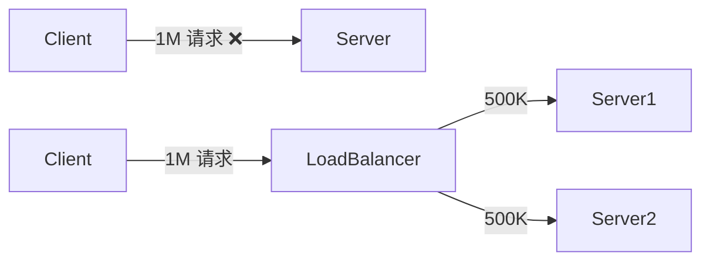

# Infrastructure of Cloud

## 1. Introduction

`SaaS`: Software as a service（软件即服务：提供云计算的软件与数据）

`PaaS`: Platform as a service（提供云计算的抽象：VM、操作系统、中间件）

`IaaS`: Infrastructure of a service（提供云计算框架：网络、存储等）

`IaaS` $\to$ `PaaS` $\to$ `SaaS`

`FaaS` : Function as a Service（无服务）

负载均衡：

**Data Center** : 存储（`NAS(Network Attach Storage)`、分布式文件系统 `GFS`）

## AWS LAB Work

